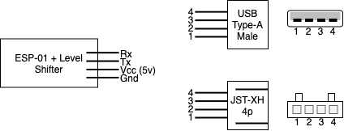
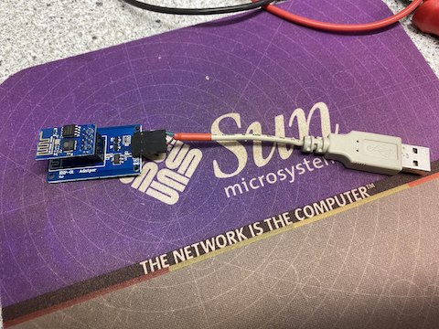
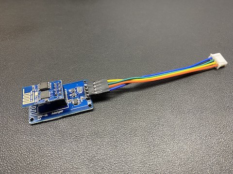

# esphome-midea-ac
Monitoring and controlling Midea-like air conditioners

## Features
* Instant feedback of command changes via RF Remote to HomeAssistant.
* Direct control without the remote.

## Supported Microcontrollers
This library should work on most ESP8266 or ESP32 platforms. It has been tested
with the following MCUs:
* Generic ESP-12S board (ESP8266)

## Usage
### Step 1: Build a control circuit.

The signal levels are TTL 5V which means a level shifter is required when using 
the ESP-01 to convert the signals from 5V to 3.3V and vice versa. Also a voltage
regulator is required if you want to power the ESP-01 from the 5V of the UART 
port.

Some AC units provide a JST-XH male connector to connect the WiFi SmartKey 
others provide a Type-A USB female connector (often connected to a JST-XH male 
connector) to connect the WiFi SmartKey. So you either need a Type-A USB male 
connector or JST-XH female connector to connect the ESP-01.

The drawing and table show which pins need to be connected.



| ESP-01 adapter | USB | JST-XH |
|-|-|-|
| Gnd | 4 | 4 |
| Vcc | 1 | 1 |
| Rx | 2 | 2 |
| Tx | 3 | 3 |




### Step 2: Clone this repository into your ESPHome configuration directory

This repository needs to live in your ESPHome configuration directory, as it
doesn't work correctly when used as a Platform.IO library, and there doesn't
seem to be an analog for that functionality for ESPHome code.

On Hass.IO, you'll want to do something like:

* Change directories to your esphome configuration directory.
* `cd config/esphome`
* `git clone https://github.com/uncle-yura/esphome-midea-ac.git`

### Step 3: Configure your ESPHome device with YAML

Create an ESPHome YAML configuration with the following sections:
 * `esphome: includes: [esphome-midea-ac]`
 * ESP8266 only: `logger: baud_rate: 0` - disable serial port logging on the
   sole ESP8266 hardware UART
 * `switch: - switch component for manual control and feedback`
 * `sensor: - temperature sensor component for automatic control`
 * `climate: - climate component ащк setting the automatic operation of the air conditioner `
 
All climate control actions are as follows:
```yaml
  - homeassistant.service:
      service:  esphome.esp_conditioner_state
      data: 
        speed: "10" # fan speed (0-100)
        mode: "-1" # mode in (auto=1,cool=2,dry=3,heat=4,fan=5)
        power: "-1" # power control (off=0,on=1)
        vswing: "-1" # vertical swing activation (off=0,on=1)
        hswing: "-1" # horizontal swing activation (off=0,on=1)
        temp: "-1" # temperature setpoint (17-30)
```
If you write "-1" in the parameter, it means that the parameter does not change.

The temperature sensor and the switch component are written to the lambda function:
```yaml
custom_component:
- lambda: |-
    auto midea_climate = new Midea(id(uart_bus),id(temperature_sensor),id(power_switch));
    return {midea_climate};
```

# Example configuration

Below is an example configuration which will include wireless strength
indicators and permit over the air updates. You'll need to create a
`secrets.yaml` file inside of your `esphome` directory with entries for the
various items prefixed with `!secret`.

```yaml
esphome:
  name: esp_conditioner
  platform: ESP8266
  board: esp12e
  includes:
  - esphome-midea-ac

wifi:
  ssid: !secret wifi_secret_ssid
  password: !secret wifi_secret_password

  # Enable fallback hotspot (captive portal) in case wifi connection fails
  ap:
    ssid: "Midea Fallback Hotspot"
    password: !secret wifi_secret_fallback_password

captive_portal:

# Enable logging
logger:
  baud_rate: 0
  
# Enable Home Assistant API
api:
  password: !secret hass_api_password

ota:
  password: !secret hass_ota_password

uart:
  id: uart_bus
  tx_pin: GPIO1
  rx_pin: GPIO3
  baud_rate: 9600
  
sensor:
- platform: template
  id: temperature_sensor
  
climate:
- platform: thermostat
  name: "Thermostat Climate Controller"
  sensor: temperature_sensor
  
  default_target_temperature_low: 20 °C
  default_target_temperature_high: 25 °C
  fan_mode_low_action:
  - homeassistant.service:
      service:  esphome.esp_conditioner_state
      data: 
        speed: "10"
        mode: "-1"
        power: "-1"
        vswing: "-1"
        hswing: "-1"
        temp: "-1"
        
  fan_mode_medium_action:
  - homeassistant.service:
      service:  esphome.esp_conditioner_state
      data: 
        speed: "25"
        mode: "-1"
        power: "-1"
        vswing: "-1"
        hswing: "-1"
        temp: "-1"
        
  fan_mode_high_action:
  - homeassistant.service:
      service:  esphome.esp_conditioner_state
      data: 
        speed: "100"
        mode: "-1"
        power: "-1"
        vswing: "-1"
        hswing: "-1"
        temp: "-1"
        
  fan_mode_middle_action:
  - homeassistant.service:
      service:  esphome.esp_conditioner_state
      data: 
        speed: "50"
        mode: "-1"
        power: "-1"
        vswing: "-1"
        hswing: "-1"
        temp: "-1"
        
  swing_vertical_action:
  - homeassistant.service:
      service:  esphome.esp_conditioner_state
      data: 
        vswing: "1"
        mode: "-1"
        power: "-1"
        speed: "-1"
        hswing: "-1"
        temp: "-1"
        
  swing_off_action:
  - homeassistant.service:
      service:  esphome.esp_conditioner_state
      data: 
        vswing: "0"
        mode: "-1"
        power: "-1"
        speed: "-1"
        hswing: "-1"
        temp: "-1"
        
  fan_only_action :
  - homeassistant.service:
      service:  esphome.esp_conditioner_state
      data: 
        mode: "5"
        temp: "-1"
        power: "1"
        speed: "-1"
        vswing: "-1"
        hswing: "-1"
        
  dry_action:
  - homeassistant.service:
      service:  esphome.esp_conditioner_state
      data: 
        mode: "3"
        temp: "23"
        power: "1"
        speed: "-1"
        vswing: "-1"
        hswing: "-1"

  cool_action:
  - homeassistant.service:
      service:  esphome.esp_conditioner_state
      data: 
        mode: "2"
        temp: "17"
        power: "1"
        speed: "-1"
        vswing: "-1"
        hswing: "-1"

  heat_action:
  - homeassistant.service:
      service:  esphome.esp_conditioner_state
      data: 
        mode: "4"
        temp: "30"
        power: "1"
        speed: "-1"
        vswing: "-1"
        hswing: "-1"

  idle_action:
  - homeassistant.service:
      service:  esphome.esp_conditioner_state
      data: 
        power: "0"
        mode: "-1"
        temp: "-1"
        speed: "-1"
        vswing: "-1"
        hswing: "-1"
  
switch:
- platform: template
  id: power_switch
  name: "Conditioner Power Switch"

  turn_on_action:
  - homeassistant.service:
      service:  esphome.esp_conditioner_state
      data: 
        power: "1"
        mode: "1"
        temp: "23"
        speed: "102"
        vswing: "0"
        hswing: "0"
  turn_off_action:
  - homeassistant.service:
      service:  esphome.esp_conditioner_state
      data: 
        power: "0"
        mode: "-1"
        temp: "-1"
        speed: "-1"
        vswing: "-1"
        hswing: "-1"

custom_component:
- lambda: |-
    auto midea_climate = new Midea(id(uart_bus),id(temperature_sensor),id(power_switch));
    return {midea_climate};
```

# See Also

## References and sources
The knowledge to create the logic to monitor and control the Midea-'like' AC 
units was gathered by reverse engineering Android applications from various 
vendors, analyzing the UART protocol between an Artel unit and an SK103 SmartKey,
documents found on the Internet, primarily in Chinese and the work from:

* Mac Zhou: <https://github.com/mac-zhou/midea-msmart>
* NeoAcheron: <https://github.com/NeoAcheron/midea-ac-py>
* Rene Klootwijk: <https://github.com/reneklootwijk/node-mideahvac>
* Sören Beye: <https://github.com/Hypfer/esp8266-midea-dehumidifier>
